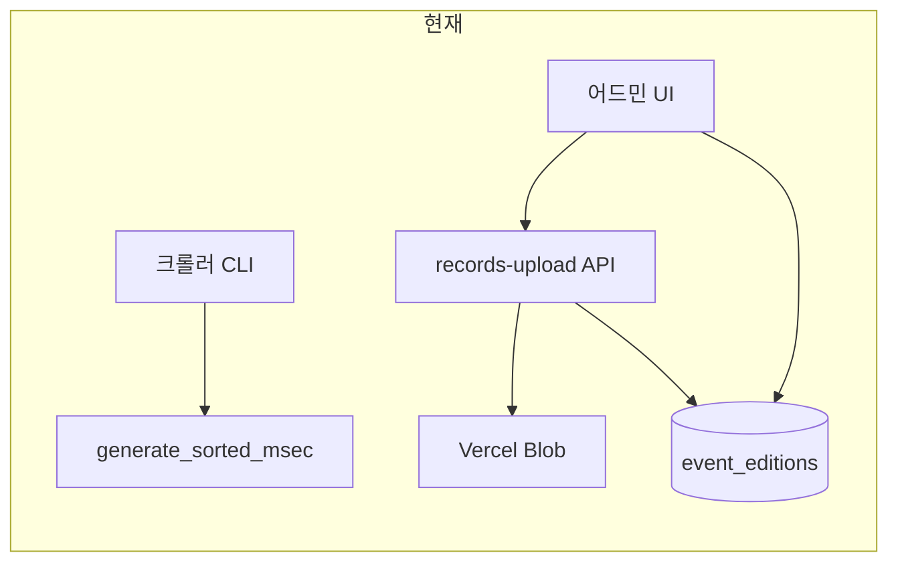

# 대회 기록 원격 반영: CLI/API 전용 워크플로 (계획)

어드민 UI 없이 원격에서도 Blob 업로드와 `event_editions` 갱신을 끝내기 위한 방향 정리이다.

**구현** (서비스 롤 + Blob 토큰 스크립트): `bun run publish:edition-records` → [`../scripts/publish-edition-records.ts`](../scripts/publish-edition-records.ts), Blob 경로 [`../lib/records-blob-path.ts`](../lib/records-blob-path.ts).

---

## 현재 구조 (코드 기준)

- **JSON Blob 업로드 + DB URL 반영**은 이미 Next API로 존재한다: `app/api/admin/event-editions/[editionId]/records-upload/route.ts`
  - `POST`, `multipart/form-data`
  - 필드명: `recordsFile`, `sortedRecordsFile` (둘 중 하나 이상)
  - 서버에서 `@vercel/blob` `put()` 후 `event_editions`의 `records_blob_url` / `sorted_records_blob_url`만 `update`
  - 인증: [`lib/supabase/server.ts`](../lib/supabase/server.ts) 쿠키 세션 + `admin_whitelist` 이메일 매칭 (403)
- **에디션 상태(`completed` 등)·기타 컬럼**은 API가 아니라 어드민 클라이언트가 Supabase에 직접 `update`한다: `app/admin/(dashboard)/events/edition-form-dialog.tsx` (RLS: `is_admin()` — [`supabase/admin_schema.sql`](../supabase/admin_schema.sql))

즉 “파일만”은 API로 가능하지만, “상태까지”는 지금은 **브라우저 세션 기반 Supabase 쓰기**에 묶여 있다.

과거 문서에 “어드민에 JSON 직접 업로드 없음”처럼 적혀 있었다면 **현재 코드와 불일치**할 수 있다(다이얼로그가 위 API를 호출). 업로드 절차는 [`docs/events/blob-publish.md`](events/blob-publish.md)를 기준으로 한다.

---

## 권장 방향 (실사용·보안 균형)

### 1순위: Bun 스크립트 + 기존 패턴 (`SUPABASE_SERVICE_ROLE_KEY`)

레포에 이미 **서비스 롤로 Supabase를 건드리는 스크립트**가 있다: [`scripts/migrate-events.ts`](../scripts/migrate-events.ts) (`dotenv` + `createClient(url, serviceRole)`).

같은 방식으로 예를 들어 `scripts/publish-edition-records.ts`를 두고:

1. `@vercel/blob`로 `put` (경로 규칙은 API와 동일하게 유지: `records/${editionId}-${Date.now()}-${uuid}.json` 등 — 현재 `buildBlobPath`와 **동일한 문자열 규칙**을 공유하거나 한 모듈로 빼기)
2. `supabase.from("event_editions").update({ records_blob_url, sorted_records_blob_url, status?: ... }).eq('id', editionId)`

**장점**: Mac Studio 등에만 `.env.local`(또는 1Password CLI 등)으로 시크릿을 두고, `curl` 쿠키 없이 원샷 실행. 원격 에이전트에서도 동일.

**주의**: 서비스 롤 키는 RLS를 우회하므로 **절대 커밋·로그 금지**, 해당 머신 접근 통제.

환경 변수: Supabase는 이미 패턴 있음. Blob은 로컬/스크립트에서 `put` 시 보통 **`BLOB_READ_WRITE_TOKEN`**(또는 프로젝트에서 쓰는 이름)이 필요 — 구현 시 Vercel 대시보드 Blob 스토어 토큰명과 맞출 것.

**CLI UX 예시** (개념):

- `--edition-id <uuid>` (필수)
- `--records <path>` / `--sorted <path>` (선택, 둘 다 가능)
- `--status completed` (선택: 한 번에 마무리)

에디션 UUID는 어드민 한 번만 확인하거나, 추후 `--slug` + `--year`로 `events` 조인 조회를 붙이면 더 편함(2단계 작업).

### 2순위: 내부용 API + 단일 시크릿 (서비스 롤을 노트북에 안 두고 싶을 때)

예: `POST /api/internal/event-editions/[editionId]/records-publish` + `Authorization: Bearer <RECORDS_PUBLISH_SECRET>` (또는 기존 프로젝트에 있는 Cron용 시크릿 패턴이 있다면 재사용).

- 서버에서만 `SUPABASE_SERVICE_ROLE_KEY` / Blob 토큰 사용
- 스크립트는 **프로덕션 URL + 긴 랜덤 시크릿**만 알면 됨

**장점**: 원격 머신에 서비스 롤 불필요.  
**비용**: 새 라우트 구현·시크릿 로테이션·남용 방지(최소한 IP 제한은 어렵다면 rate limit 고려) 정책 필요.

### 단기 우회 (구현 없이)

- 브라우저에서 로그인한 상태의 **쿠키를 복사**해 `curl -F recordsFile=@... -F sortedRecordsFile=@... https://<배포도메인>/api/admin/event-editions/<editionId>/records-upload` 호출 — **이론상 가능**하나 쿠키 만료·복사 실수·보안에 취약해 비권장.
- 상태 변경은 Supabase **SQL Editor / Table Editor**에서 해당 행 `status`만 바꾸는 식으로 가능(수동이지만 UI 어드민보다 가볍게 원격 가능).

---

## 정리

**운영 안정성 기준 최선**: 신뢰할 수 있는 머신에만 시크릿을 두고, **기존 `migrate-events`와 같은 Bun 스크립트**로 Blob `put` + `event_editions` 업데이트(+선택적 `status`)를 한 커맨드로 묶는 것. 업로드용 API는 이미 있으므로 **새로 “DB에 넣는 API”를 발명할 필요는 없고**, 자동화 계층만 추가하면 된다.

원치 않으면 그 다음으로 **내부 시크릿 API**로 서비스 롤 노출 범위를 Vercel로만 제한하는 방식이 좋다.

---

## 구현 시 체크리스트 (참고)

- [x] 서비스 롤 스크립트(Mac Studio `.env`) — 채택. 내부 시크릿 API는 필요 시 후속
- [x] Blob `put` + `event_editions` patch — `buildRecordsBlobPath`와 `records-upload` API 정합
- [x] `slug` + `year`로 edition id 조회 — `--slug` / `--year`
- [x] `docs/events/blob-publish.md` — Blob·에디션 URL 표·절차 갱신
