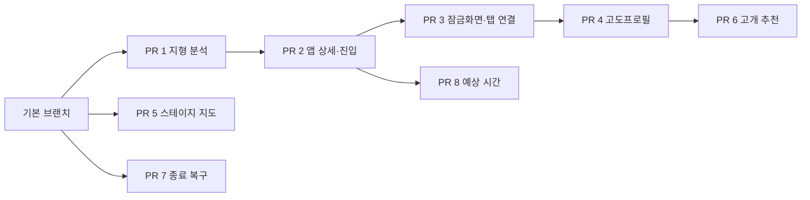

# 백두대간 울트라 로드 800 실사용 피드백 — 요구사항·PR 분할안

작성일: 2026-10-10
상태: 사용자 승인에 따라 8개 PR 생성 완료. GitHub 병합 없음. 구현·검증 결과와 실제 기기 확인 항목은 [PR 실행 안내](../pr-validation/ultra-road-pr-guide.md)에 기록했다.

## 1. 해결하려는 문제

라이더는 다음 큰 오르막까지의 구간을 보고 체력과 보급을 배분해야 한다. 지금은 큰 고개 사이의 긴 평지와 반복되는 작은 오르막이 충분히 드러나지 않아, 대부분 내리막으로 쉬면서 갈 수 있다고 예상하게 된다.

목표는 현재 위치에서 **다음 보급소까지 어떤 지형을 얼마나 달려야 하는지**, **다음 본격적인 오르막이 시작될 때까지 어떤 지형을 얼마나 달려야 하는지**, 그리고 **그 정상까지 얼마나 더 올라야 하는지**를 앱을 열지 않고 잠금화면에서도 알아볼 수 있게 하는 것이다. 보급소가 없어진 뒤에도 남은 오르막을 안내한다. 지도는 오늘의 스테이지를 바로 볼 수 있어야 하고, 종료를 놓쳐도 실제 종료 지점을 나중에 지정할 수 있어야 한다.

잠금화면은 짧은 요약을 제공하고, 누르면 앱이 해당 라이딩의 상세 지형 안내로 바로 이어진다. **잠금화면과 앱의 연결, 세련되고 편리하고 직관적인 UI는 핵심 범위이며 별도 후속 개선으로 미루지 않는다.**

두 번째 피드백의 ‘2, 3번을 마지막에’는 앞서 확인 질문의 2번(종료 복구), 3번(예상 시간 안내)을 뜻하는 것으로 잠정 해석했다. 지형 분석은 보급소·오르막 안내에 필요한 선행 작업이므로 먼저 한다. 번호의 의미는 확인 중이다.

메모의 ‘맵은 스테이지만 볼 수 없고 전체 복수’는 ‘스테이지 지도 없이 전체 코스만 표시된다’는 의미로 해석했다. 지도와 고도프로필은 별도 개선 대상으로 다룬다.

## 2. 현재 구현에서 확인한 사실

- 모바일 앱은 `apps/plan-my-route-app`, 웹·API는 `apps/plan-my-route`, 공용 계산은 `packages/plan-geometry`, 공용 고도프로필은 `packages/elevation-profile`에 있다.
- 모바일 스테이지의 경로 탭은 해당 스테이지의 고도 요약과 ‘전체 경로 지도 열기’를 제공한다. 지도 화면에는 선택한 스테이지를 전달하지 않으며, 전체 트랙을 기준으로 초기 화면을 잡는다.
- 모바일 경로 탭의 고도 요약은 스테이지를 72개 구간으로 나누고 각 구간의 최고 표고를 표시한다. 작은 오르내림이 생략될 가능성이 있다. 실사용 중 착시의 원인이 이것 하나라고 확정하지는 않는다.
- 공용 경사도 색상은 모든 음수 경사를 같은 회색으로, 0~4% 미만의 경사를 같은 녹색으로 묶는다. 평지·약내리막·낙타등을 구별하는 지형 모델은 별도로 필요하다.
- 기존 `detectClimb`은 주어진 정상 위치에서 오르막 시작점을 역으로 찾는다. 전체 트랙에서 이름 없는 오르막까지 찾아내는 기능과는 다르다.
- 현재 ‘스테이지 종료’는 현재 GPS 위치로 스테이지를 짧게 만들고 다음 스테이지의 시작점을 맞추며, 뒤에 남은 명시적 POI를 다음 스테이지로 옮긴다. 완료 여부를 기록하는 기능으로 해석하면 안 된다.
- 현재 종료 기능은 다음 스테이지가 있고, 현재 위치가 스테이지 시작점과 기존 종료점 사이일 때만 사용할 수 있다. GPS를 얻지 못하거나 종료점을 지난 경우 사용할 수 없다.
- 종료 처리는 POI와 두 스테이지를 여러 요청으로 저장한다. 복구 흐름을 추가할 때 부분 저장·재시도 동작도 확인해야 한다.
- iOS Live Activity의 현재 잠금화면은 스테이지에 속하는 앞쪽 미방문 편의점·마트를 최대 3곳 표시한다. 보급소 이름·거리·누적 획득고도를 표시하며, 보급소가 없으면 ‘남은 보급소 없음’과 빈 거리 표시로 끝난다.
- 잠금화면용 예시 데이터에는 오르막 문구가 있지만 실제 GPS 기반 데이터 생성에는 다음 오르막 안내가 없다. 실사용 기능으로 연결해야 한다.
- 현재 배너는 최대 높이 160으로 구성돼 있다. 보급소 목록과 지형 정보를 계속 늘리는 방식 대신 실제 잠금화면에서 읽을 수 있는 정보 우선순위를 설계해야 한다.
- GPS 갱신과 저장된 라이딩 세션을 복원하는 기존 흐름이 있다. 지형 분석도 이 흐름에서 복원·갱신되고 앱 화면과 같은 계산 결과를 사용해야 한다.
- 현재 실제 Live Activity를 시작할 때 탭 링크는 해당 플랜의 `schedule` 화면으로 지정한다. 목적지와 접근 지형을 바로 보여주는 상세 진입 흐름이 추가로 필요하다.

## 3. 제안하는 요구사항

### R1. 스테이지 지도

- 스테이지 상세에서 지도를 열면 해당 스테이지가 기본 표시 범위다.
- 선택한 스테이지의 경로, 출발·도착, 해당 구간의 CP·고개·POI를 볼 수 있다.
- ‘이 스테이지 / 전체 코스’를 전환하고 현재 위치로 이동할 수 있다.
- 선택 범위 밖의 경로·마커 때문에 스테이지 화면이 다시 전체 코스로 축소되지 않는다.
- 스테이지를 선택하지 않고 전체 지도에 진입한 경우에는 전체 코스를 기본으로 보여준다.

### R2. 스테이지 종료를 나중에 처리

- 현재 GPS 위치에 있지 않아도 ‘종료 지점 직접 선택’으로 실제 라이딩을 마친 경로 지점을 지정한다.
- 1차 입력 수단은 경로 누적 거리와 계획된 종료점이다. 거리 기준은 ‘전체 경로 기준 km’로 명시하고, 스테이지 내 거리도 함께 보여준다.
- 현재 위치는 편리한 입력 수단으로 유지한다. 과거 위치 기록이 있다고 가정하지 않는다.
- 저장 전에 변경할 종료점, 다음 시작점, 거리·획득고도, 이동할 POI를 미리 보여준다.
- 현재 기능과 같은 조기 종료는 기존 종료점보다 앞선 지점만 허용한다. 출발 전 지점, 다음 스테이지와 순서가 뒤집히는 지점 등은 거부한다.
- 저장 실패 후 재시도해도 POI가 중복 이동하거나 스테이지 사이에 틈·겹침이 생기지 않아야 한다.
- 실제 종료점이 계획된 종료점보다 뒤인 경우, 마지막 스테이지, ‘계획 그대로 완료 표시’는 현재 조기 종료와 의미가 다르다. 아래 확인 항목에서 포함 여부를 정한 뒤 사양을 확장한다.

### R3. 지형 분석과 이름 없는 오르막 탐지

- 표시용으로 줄인 그래프가 아니라 원본 거리·고도 데이터로 지형을 분석한다.
- 내리막, 약내리막, 평지, 반복되는 오르내림(낙타등), 본격적인 오르막을 구별한다. 작은 오르막을 모두 고개로 등록하지 않아도 낙타등의 부담이 드러나야 한다.
- 구간 길이와 누적 상승·하강량을 함께 사용한다. 끝 표고가 낮다는 이유만으로 중간 구간 전체를 내리막으로 분류하지 않는다.
- 고도 잡음과 불균등한 샘플 간격을 처리한다. 고도 누락·큰 데이터 공백은 평지로 간주하지 않고 분석 불가로 표시한다.
- 등록된 고개와 별개로 유의미한 오르막 후보의 시작점·정상·길이·누적 획득고도를 탐지한다.
- 경사·최소 길이·상승량·구간 병합 기준은 첫 분석 PR에서 명시하고 테스트로 검증한다. 수치 기준은 아직 확정하지 않는다.
- ‘본격적인 오르막 시작’은 체감상 지속적인 상승이 시작되는 지점을 목표로 한다. 사용자의 와후 서밋 표현은 참고 경험이며 기기와 동일한 감지 시점을 보장한다는 뜻은 아니다.
- 스테이지 경계에서 오르막이 잘리더라도 전체 트랙의 오르막과 표시 범위를 구별한다. 다음 정상이나 시작점이 스테이지 밖이면 그 사실을 표시한다.

### R4. 다음 오르막까지의 거리와 부담

- 잠금화면과 앱 상세에서 현재 위치를 기준으로 다음 본격적인 오르막의 시작점과 정상 정보를 보여준다. 화면 흐름을 함께 설계하고, 앱 상세와 진입 연결을 먼저 구현한 뒤 잠금화면에 연결한다.
- 서로 다른 거리 세 가지를 혼동하지 않게 표시한다.
  1. 현재 위치 → 다음 오르막 시작점까지 전체 접근 거리.
  2. 접근 구간에 포함된 평지·약내리막·낙타등 등 지형별 거리와 접근 구간의 누적 획득고도.
  3. 오르막 시작점 → 정상까지 오르막 자체의 거리·누적 획득고도, 현재 위치 → 정상까지 총 거리·남은 누적 획득고도.
- 획득고도는 출발·도착 표고 차가 아니라 중간 오르내림을 포함한 누적 상승량이다.
- 이미 오르막에 들어왔으면 시작점까지의 거리 대신 진행 중인 오르막의 정상까지 남은 거리·획득고도를 앞에 표시한다.
- 위치를 모르면 스테이지 시작점 또는 사용자가 고른 지점을 기준으로 미리보기하며, 실제 현재 위치처럼 표시하지 않는다.
- 이름 없는 탐지 오르막도 안내한다. 이름은 ‘미등록 오르막’ 등으로 표시하고, 등록하지 않았다는 이유로 다음 오르막 후보에서 빼지 않는다.
- 다음 오르막이 없거나 분석 데이터가 부족한 경우 각각 다른 상태를 표시한다.
- 시간 예측은 마지막 개발 항목으로 미룬다. 포함한다면 사용자가 설정한 속도 등 설명 가능한 근거와 기준을 함께 표시한다. 바람·피로·휴식까지 반영한 도착 시각을 약속하지 않는다.

표시 예시 — 숫자는 설명용 가상 데이터:

> 다음 오르막 시작까지 18.4km · 접근 구간 상승 +160m  
> 평지 8.0km / 약내리막 6.0km / 낙타등 4.4km  
> 오르막 자체 6.2km · +430m  
> 현재부터 정상까지 24.6km · +590m

### R5. 고도프로필에서 착시 줄이기

- 스테이지 전체 보기와 선택한 구간 상세 보기를 제공한다. 긴 접근 구간과 작은 오르내림을 확대해서 볼 수 있어야 한다.
- 거리축, 표고축, 표시 범위를 명시하고, 현재 위치·오르막 시작점·정상을 식별할 수 있게 한다.
- 축소할 때 주요 봉우리·골짜기·지형 경계를 보존하는 방법을 적용한다. 72구간 최고 표고 요약만으로 상세 지형 판단을 요구하지 않는다.
- 고도프로필 아래 거리 비례의 지형 띠와 텍스트 요약을 함께 표시한다. 긴 평지와 낙타등의 실제 길이가 드러나야 한다.
- 고도 곡선의 화면상 기울기를 도로 경사도로 해석하지 않도록, 지형 분류와 실제 경사 수치를 별도로 제공한다. 색상만으로 구별하지 않는다.
- 선택한 구간에 R4의 거리·누적 상승량을 함께 표시하고, 그래프와 안내 카드가 같은 분석 결과를 사용한다.

### R6. 스테이지를 스캔해 등록할 고개 추천

- 선택한 스테이지의 탐지 오르막 후보를 거리 순서로 보여준다.
- 시작점·정상 위치, 거리·획득고도·경사, 기존 등록 여부를 확인할 수 있다.
- 이미 등록된 정상과 겹치는 후보를 표시하고 중복 등록을 방지한다. 같은 고개를 여러 번 통과하는 경우 경로상 통과 지점을 구별한다.
- 이름 없는 후보에는 자동으로 지명을 지어내지 않는다. 사용자가 이름을 입력하거나 기존 고개를 연결해 등록한다.
- 후보를 선택해 등록하거나 추천 목록에서 제외할 수 있다. 추천 제외와 라이딩 지형 안내에서 숨기기는 구별한다.
- 정식 고개 목록과 탐지 오르막은 구별하되, 탐지 오르막은 R4·R5에서 계속 볼 수 있다.
- 목표는 유의미한 오르막의 누락을 줄이는 것이다. 고도 데이터만으로 모든 실제 고개와 정확한 지명을 보장하지 않는다.

### R7. 잠금화면에서 보급소와 오르막까지의 지형 안내

- 기존 보급소 안내의 유용성을 유지하면서 다음 보급소와 다음 본격적인 오르막을 함께 표시한다. 두 목적지 중 하나만 사용자가 선택해야 하는 흐름은 기본안으로 두지 않는다.
- 다음 보급소: 이름, 경로 기준 남은 거리, 그 지점까지의 남은 누적 획득고도, 주요 지형과 거리.
- 다음 오르막: 이름 또는 미등록 오르막 표시, 시작까지의 거리와 접근 지형, 오르막 자체의 거리·획득고도. 진입 후에는 정상까지 남은 거리·획득고도로 바꾼다.
- ‘평지 8km / 낙타등 4km’처럼 지형별 양을 보여주는 것뿐 아니라 ‘평지 → 오르막 → 내리막’처럼 주행 순서도 설명할 수 있어야 한다. 잠금화면에서는 중요한 순서를 압축하고 앱에서 전체 구간을 확인한다.
- 보급소 전에 본격적인 오르막이 있으면 ‘보급 전 오르막 1개’ 등의 짧은 문구로 드러낸다. 보급소보다 뒤에 있는 다음 오르막을 보급 전에 넘어야 하는 것처럼 표시하지 않는다.
- 지형별 거리는 목적지까지 실제 구간에 맞게 자른다. 목적지가 오르막 중간에 있으면 정상까지 전체 오르막을 보급소 접근 거리로 계산하지 않는다.
- 상태별 기본 우선순위:
  - 보급소와 오르막 있음: 다음 보급소 + 다음 오르막을 함께 안내.
  - 보급소 없음, 오르막 있음: 해당 스테이지에 남은 보급소 후보가 없음을 짧게 알리고 남은 오르막 안내를 주 정보로 표시. 다음 오르막뿐 아니라 스테이지 끝까지 남은 오르막 수·획득고도도 요약.
  - 보급소 있음, 오르막 없음: 다음 보급소까지의 지형과 거리 안내를 유지하고 해당 스테이지에 본격적인 오르막이 더 없음을 표시.
  - 둘 다 없음: 스테이지 종료점까지 남은 거리·지형·획득고도를 표시. 목적지에 도착하면 도착 상태로 전환.
  - 위치 대기·경로 이탈·고도 분석 불가: 상태를 명시하고 불확실한 거리·지형을 확정값처럼 보여주지 않음. 고도만 없으면 이용 가능한 보급소 이름·거리는 유지.
- ‘보급소 없음’은 현재 선택·등록한 후보와 스테이지 범위 안에서 없다는 뜻이다. 실제 도로 주변의 모든 상점이 없다고 주장하지 않는다.
- 두 번째·세 번째 보급소보다 ‘바로 다음 보급까지의 지형’과 ‘다음 오르막’을 높은 우선순위로 둔다. 추가 보급소를 얼마나 유지할지는 실제 기기 배너 높이와 가독성 검증 후 결정한다.
- 잠금화면에 압축한 내용의 상세 설명은 R8의 앱 화면으로 바로 이어진다. 잠금화면과 Dynamic Island의 표시 공간 차이를 고려하고 작은 영역에 모든 정보를 넣지 않는다.
- 갱신 시각을 확인할 수 있게 한다. GPS 잡음으로 다음 목적지가 반복해서 바뀌는 현상, 통과 후 다음 보급소·오르막으로 넘어가는 동작을 검증한다.
- 매 GPS 갱신마다 전체 코스를 다시 분석하거나 네트워크 요청을 요구하지 않는다. 트랙·플랜 변경 시 분석을 준비하고 현재 위치부터 목적지까지의 결과를 갱신한다. 저장된 이전 형식의 세션도 안전하게 복원한다.

잠금화면 문구 예시 — 숫자는 설명용 가상 데이터이며 최종 레이아웃은 구현 중 기기에서 검증:

> 다음 보급 · CU ○○점 12.4km · +140m  
> 평지 8.0 / 약내리막 3.0 / 낙타등 1.4km  
> 다음 오르막 시작 4.2km · 평지 → 낙타등  
> 오르막 자체 3.8km · +220m · 보급 전 통과

보급소가 없을 때:

> 남은 보급 후보 없음 · 스테이지 2  
> 다음 오르막 시작 4.2km · 평지 → 낙타등  
> 오르막 자체 3.8km · +220m  
> 오늘 남은 오르막 2개 · 오르막 구간 상승 +510m

### R8. 잠금화면을 누르면 이어지는 앱 상세

- 기본 흐름은 ‘잠금화면 요약 → 탭 → 진행 중인 라이딩의 앞으로의 지형 상세’다. 홈·플랜 목록·일정 목록에서 사용자가 다시 해당 정보를 찾아야 하는 흐름으로 만들지 않는다.
- 잠금화면 전체 탭은 해당 라이딩의 다음 보급소와 다음 오르막을 함께 볼 수 있는 상세 화면으로 연결한다. 영역별 링크가 지원되고 충분히 누르기 쉬우면 보급소·오르막 영역을 각각 해당 구간으로 연결한다. 영역별 탭 가능 여부는 구현에서 검증하며 기본 흐름은 전체 탭만으로도 완성한다.
- 앱 상세 첫 화면은 현재 스테이지, 현재 위치 기준, 다음 보급소와 다음 오르막, 각각까지의 거리·누적 획득고도·주요 지형을 보여준다.
- 상세 구간의 선택지는 ‘다음 보급소까지 / 다음 오르막 시작까지 / 정상까지’로 명명한다. 오르막 진입 후에는 ‘정상까지’를 우선한다. 보급소가 없으면 남은 오르막을 바로 펼치고, 둘 다 없으면 스테이지 종료점까지를 보여준다.
- 아래에 현재 위치부터 선택한 목적지까지의 거리 비례 지형 띠와 구간 순서, 구간별 거리·획득고도, 주요 오르막의 시작·정상 표시를 제공한다. 보급소가 오르막 전/중/후 어디에 있는지 확인할 수 있게 한다.
- 초기 상세 PR에서 목적지까지의 간결한 지형 띠·구간 목록을 완성한다. 스테이지 전체 고도프로필의 확대·탐색 개선은 뒤 PR에서 추가한다.
- 앱의 라이딩 탭에서도 같은 상세 정보에 접근한다. 잠금화면을 거쳐야만 사용할 수 있는 화면으로 만들지 않는다.
- 앱이 실행 중이거나 종료된 상태 모두에서 탭 후 동일한 목적지로 연결한다. 기존 라이딩 복원 경로가 탭으로 요청한 상세 진입을 덮어쓰지 않아야 한다. 로그인이 필요하면 인증 후 요청한 라이딩으로 돌아간다.
- 잠금화면을 누르는 사이 통과한 보급소·오르막은 최신 상태로 갱신하고 ‘방금 통과’ 등으로 맥락을 설명한다. 없어진 후보, 수정된 플랜, 종료된 라이딩에는 이유와 다음에 볼 정보를 보여준다.
- 저장된 위치 기준과 최신 위치 기준을 구별한다. 최신 위치 수신 전 오래된 값을 현재 확정 위치처럼 표시하지 않고, 연결이 없어도 저장된 데이터가 있으면 해당 기준을 명시해 보여준다.
- 데이터 갱신 중에는 기존 내용과 선택 구간을 유지한다. 보급소 통과 등 실제 상태 변화에 반응하되 갑자기 스크롤 위치나 사용자가 보고 있던 구간을 빼앗지 않는다.

## 3-1. UI·UX 설계 기준

적용 지침: `frontend-design`의 의도적인 정보 구조·타이포그래피·절제·실제 화면 비평, `building-native-ui`의 네이티브 탐색·안전 영역·반응형 구성. 이 제품은 장거리 라이딩 중 짧게 확인하는 도구이므로 읽기와 조작을 우선한다.

- **한눈에 읽기:** 목적지와 남은 거리를 가장 먼저 읽고, 지형과 획득고도가 이어진다. 보급과 오르막은 아이콘·문구·위치로 구별한다.
- **시각적 중심:** 거리 비례의 지형 흐름을 화면의 중심 요소로 삼는다. 같은 모양의 카드를 계속 늘리지 않고 관련 수치는 한 구간 안에서 정렬한다.
- **정보의 단계:** 잠금화면의 짧은 요약, 앱 첫 화면의 전체 판단, 선택한 구간의 세부 설명 순으로 확장한다. 정보가 많아도 첫 화면에서 핵심을 찾을 수 있어야 한다.
- **숫자의 의미:** ‘시작까지’, ‘오르막 자체’, ‘정상까지’를 명시한다. km와 m의 단위를 일관되게 쓰고, 남은 거리와 획득고도 숫자 자릿수가 안정적으로 정렬되도록 한다.
- **직접 조작:** 중요한 탭 대상은 최소 44pt 크기를 기준으로 하고, 정보 영역 전체를 누를 수 있게 한다. 필수 기능을 작은 아이콘이나 숨은 제스처에만 두지 않는다.
- **환경 적응:** 작은 화면, 큰 글자 설정, 라이트·다크 모드, 강한 햇빛에서도 핵심 수치와 선택 상태가 읽혀야 한다. 지형을 색상만으로 설명하지 않는다.
- **안정적인 갱신:** GPS가 갱신될 때 숫자·표시 위치가 불필요하게 흔들리지 않도록 하고, 자동 점멸·장식 애니메이션은 사용하지 않는다. 사용자의 선택이나 전환을 설명하는 짧은 움직임만 사용하며 모션 감소 설정을 존중한다.
- **상태도 제품 화면:** 보급소 없음, 오르막 없음, GPS 대기, 고도 누락을 완성된 화면 상태로 설계한다. 빈 화면 대신 다음 판단에 필요한 정보를 제공한다.
- **일관된 언어:** 잠금화면·상세·그래프가 같은 목적지 이름과 용어를 쓴다. ‘앞으로의 지형’, ‘다음 보급소까지’, ‘오르막 시작까지’, ‘정상까지’처럼 라이더가 이해하는 문구를 사용한다.

초기 디자인 토큰 방향 — 새 테마를 임의로 추가하지 않고 기존 앱 테마를 바탕으로 조정:

- 바탕 `#FFFFFF`, 기본 글자 `#000000`, 보조 글자 `#60646C`, 구간 바탕 `#F2F2F7`, 조작·선택 `#007AFF`, 보급 강조 `#FF9500`. 다크 모드는 기존 대응 토큰을 쓴다. 지형 색상은 공용 의미 체계를 사용하고 문구를 함께 붙인다.
- 기본 글꼴은 기존 iOS 시스템 산세리프, 중요한 거리 숫자는 시스템 숫자 스타일과 정렬된 자릿수를 사용한다. 타이포그래피 위계는 목적지·주 수치·지형 설명·갱신 상태 순이다. 실제 크기는 큰 글자 설정과 잠금화면 높이에서 검증한다.
- 앱 상세는 왼쪽 정렬, 중요한 거리 숫자는 오른쪽 정렬한다. 세로로 읽는 지형 흐름과 가로 거리 띠를 연결하고 충분한 여백으로 구간을 구별한다.
- 디자인의 특징은 이 라이딩에 필요한 ‘목적지까지 이어지는 지형’이다. 장식용 그라디언트·유리 효과·그림자를 새 화면마다 반복하지 않는다.

앱 상세 구조 예시 — 가상 데이터, 최종 시각 디자인 전 정보 구조 검토용:

```text
앞으로의 지형                  스테이지 2
현재 위치 기준                 14:32 갱신

다음 보급소                    12.4km
CU ○○점                        상승 +140m
평지 뒤 낙타등 · 보급 전에 오르막 1개

다음 오르막 시작                4.2km
오르막 자체 3.8km              상승 +220m

[보급소까지] [오르막 시작까지] [정상까지]

현재 ── 평지 ─ 낙타등 ─ 오르막 ─ 내리막 ─ 보급
           거리 비례 지형 띠

평지 3.0km
낙타등 1.2km                   상승 +35m
오르막 …                       시작·정상
…
```

PR 2 착수 때 짧은 디자인 안을 만들고 요구사항과 기존 앱에 맞는지 먼저 비평한다. 구현 후 스크린샷으로 정보 위계·밀도·터치 영역·상태별 일관성을 다시 확인한다. 스크린샷과 연결 흐름의 검증 결과를 UI PR에 첨부해 사용자가 브랜치를 실행하기 전에도 검토할 수 있게 한다.

## 4. 개발 순서와 PR 단위

PR 번호는 실행 순서다. 실제 의존성이 없는 PR은 기본 브랜치에서 각각 만들고, 의존하는 PR만 앞 PR의 브랜치를 기반으로 만든다.

| 순서 | PR 제목 | 범위 | 기반 | 사용자가 확인할 핵심 |
| --- | --- | --- | --- | --- |
| 1 | 보급소・오르막 접근 구간의 지형 분석 | R3: 공용 분석, 미등록 오르막 탐지, 목적지까지 지형 요약 | 기본 브랜치 | 끝 표고가 낮아도 긴 평지·낙타등을 계산으로 구별하는가 |
| 2 | 보급소・오르막 접근 지형의 앱 상세와 직접 진입 | R4・R8: 상세 화면, 구간 선택, 라이딩 탭 진입, 탭 연결을 받을 경로・복원 | PR 1 | 보급・오르막까지의 구간을 직관적으로 읽고 바로 진입하는가 |
| 3 | 잠금화면 요약과 탭 후 앱 상세로 이어지는 흐름 | R7・R8: 실제 GPS 연결, 보급・오르막 표시, 정보 없을 때 대체 안내, 앱 상세 연결 | PR 2 | 짧게 확인하고 눌러 동일한 라이딩의 상세를 바로 보는가 |
| 4 | 지형을 읽을 수 있는 스테이지 고도프로필 | R5: 상세 범위, 축, 지형 띠, 주요 봉우리·골짜기 보존 | PR 3 | 긴 평지와 낙타등의 길이를 그래프로 확인하는가 |
| 5 | 모바일 지도에서 선택한 스테이지 바로 보기 | R1: 초기 범위, 스테이지/전체 전환, 마커 범위 | 기본 브랜치 | 오늘의 스테이지가 바로 보이는가 |
| 6 | 스테이지 오르막 스캔과 고개 등록 추천 | R6: 후보 목록, 기존 고개 연결, 중복 방지 | PR 4 | 등록을 빠뜨린 고개를 찾아 검토·등록하는가 |
| 7 | 현재 위치 없이 스테이지 종료 지점 지정 | R2: 거리 입력, 변경 미리보기, 저장・재시도 일관성 | 기본 브랜치 | 실제 종료점을 나중에 지정하는가 |
| 8 | 보급소・오르막까지 단순 예상 주행 시간 | 설정 속도에 따른 예상 시간과 산정 근거. 세부 사양은 착수 전 확인 | PR 2 | 거리·지형 안내를 바탕으로 시간을 함께 가늠하는가 |



최우선 가치는 ‘잠금화면에서 보급소·오르막 접근 지형을 읽고, 누르면 앱 상세로 바로 이어지는 경험’이다. 기초 계산 다음에 앱 상세와 진입 경로를 만들고, 그다음 잠금화면을 연결한다. 잠금화면 개선 PR을 테스트할 때 상세 진입까지 완성돼 있어야 한다. 지도와 고개 등록 화면은 핵심 안내가 완성된 뒤 진행한다. 고개를 등록하기 전에도 미등록 오르막을 안내하며, 종료 복구와 예상 시간은 마지막 두 항목으로 미룬다. 예상 시간의 기본 산정 방식은 해당 기능 착수 전에 확정한다.

## 5. 검증 계획

- 지도: 서로 멀리 떨어진 여러 스테이지가 있는 코스에서 초기 표시 범위, 전환, 경계 마커를 확인한다.
- 종료: GPS 없음, 종료점을 떠난 상태, 입력 범위 오류, 조기 종료 뒤 POI 재배치, 저장 실패·재시도를 검증한다. 연장 종료·최종 스테이지는 포함이 확정되면 별도 시나리오를 추가한다.
- 분석: 지속 하강, 긴 평지, 전체적으로 내려가지만 중간 상승이 반복되는 낙타등, 연속 오르막, 복합 오르막, 잡음·고도 누락·불균등 샘플·스테이지 경계를 포함한 데이터로 검증한다.
- 안내: 오르막 전/중/후, 미등록 오르막, 다음 오르막 없음, 위치 없음에서 거리와 남은 누적 획득고도를 검증한다.
- 잠금화면: 보급소·오르막 모두 있음, 보급소만 없음, 오르막만 없음, 둘 다 없음, 목적지 도착, 고도 누락, 위치 이탈을 검증한다. 보급소가 오르막 전/중/후에 있는 경우 목적지까지의 구간 절단과 지형 순서를 확인한다.
- 실제 iOS 잠금화면의 글자 잘림·배너 높이·Dynamic Island를 확인한다. 백그라운드 GPS 갱신, 앱 재시작 후 복원, 플랜 편집 후 갱신, 분석 계산 비용도 확인한다. 실제 기기 검증이 불가능하면 결과를 확인한 범위와 미검증 사항을 PR에 명시한다.
- 연결: 앱 실행 중·종료 상태의 잠금화면 탭, 인증 후 복귀, 기존 복원 경로와 충돌, 탭 전후 목적지 통과・플랜 변경・라이딩 종료를 검증한다. 앱의 라이딩 탭에서도 같은 상세 정보를 확인한다.
- UI: 작은 화면・큰 글자・라이트/다크・모션 감소 설정, 거리・단위・지형 순서의 가독성, 최소 터치 영역, 위치 갱신 중 선택・스크롤 유지, 빈 상태를 스크린샷으로 확인한다.
- 그래프: 축소 전후 주요 지형과 분석 수치의 일치, 작은 화면에서 읽기, 선택 범위 변경을 확인한다.
- 추천: 기존 고개·CP와의 중복, 동일 고개 재통과, 추천 제외 후 지형 안내 유지, 등록 후 중복 후보 감소를 검증한다.
- 실제 대회 코스 데이터가 저장돼 있고 접근 가능하다면 대표 구간을 추가로 확인한다. 데이터를 아직 읽지 않았으므로 실제 코스 검증이 완료됐다고 보고하지 않는다.

## 6. 합의 후 자동 실행 방식

- 이 요구사항과 분할안에 대한 사용자 확인을 한 번 받은 뒤 순서대로 개발·검증·커밋·푸시·PR 생성을 진행한다.
- 각 PR을 올린 다음 사용자의 리뷰나 병합을 기다리지 않고 다음 PR을 개발한다. 범위를 바꾸는 중요한 새 결정이나 외부 권한 차단이 있으면 설명한다.
- PR마다 포함 기능, 의존 PR, 테스트 결과, 직접 체크아웃할 브랜치와 수동 테스트 절차를 기록한다. 후속 브랜치에는 기반 PR의 변경이 포함된다.
- 사용자가 브랜치를 테스트할 수 있도록 각각의 상태를 남기고, 사용자 승인 없이 병합하지 않는다.
- 실행은 이 채팅의 작업으로 이어간다. 앱이 닫힌 뒤나 먼 미래의 재실행까지 보장하려면 별도의 자동화 설정이 필요하며, 현재는 만들지 않았다.

## 7. 이번 수정안 확인 항목

1. **경험:** 잠금화면 요약 → 탭 → 같은 라이딩의 앱 상세 → 구간별 지형・거리・획득고도로 이어지는 흐름이 핵심이며 UI 품질을 함께 검증한다.
2. **순서:** 지형 분석 → 앱 상세・직접 진입 → 잠금화면・탭 연결 → 고도프로필 → 지도 → 고개 추천 → 종료 복구 → 예상 시간.
3. **번호 해석:** ‘2, 3번’이 종료 복구와 예상 시간을 뜻하는 것으로 잠정 반영했다. 이전 PR 표의 지형 분석을 뜻한다면 핵심 안내의 선행 계산과 등록 추천 기능을 구별해 순서를 다시 맞춘다.
4. **대상:** 확인한 기존 iOS 잠금화면과 모바일 앱을 우선 개선하고, API·공용 계산을 필요한 만큼 함께 수정한다. 웹 모든 화면의 동시 개선은 기본 범위에 포함하지 않는다.

종료 기능의 의미와 예상 시간 산정 방식은 우선 개발의 장애물로 두지 않고 후순위 기능 착수 전에 확정한다. 세부 계산 기준과 화면 구성은 합의된 목적 안에서 개발 중 검증해 결정한다.
